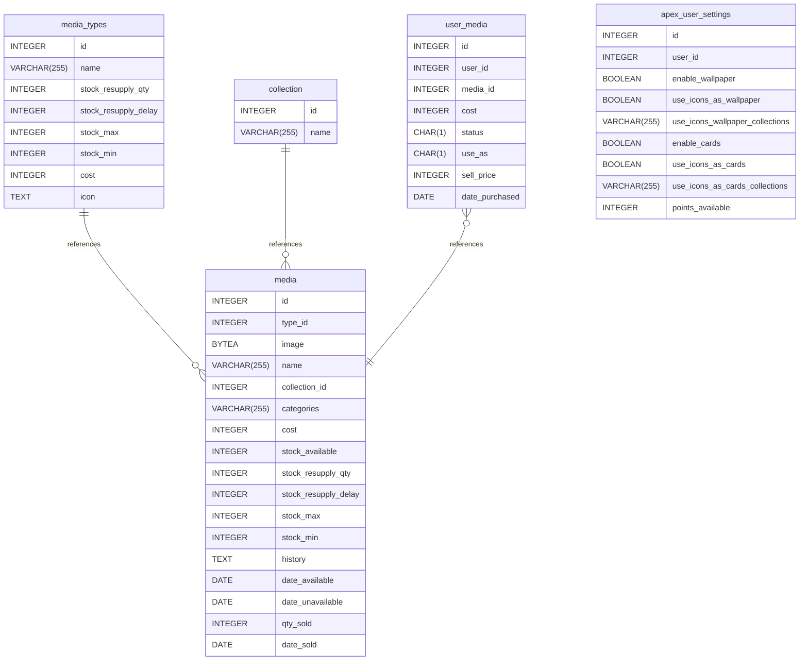

# APEX Media documentation
## Summary

- [Introduction](#introduction)
- [Database Type](#database-type)
- [Table Structure](#table-structure)
	- [media](#media)
	- [media_types](#media_types)
	- [collection](#collection)
	- [user_media](#user_media)
	- [apex_user_settings](#apex_user_settings)
- [Relationships](#relationships)
- [Database Diagram](#database-diagram)

## Introduction

## Database type

- **Database system:** PostgreSQL
## Table structure

### media

| Name        | Type          | Settings                      | References                    | Note                           |
|-------------|---------------|-------------------------------|-------------------------------|--------------------------------|
| **id** | INTEGER | 🔑 PK, not null, unique, autoincrement |  | |
| **type_id** | INTEGER | null |  | |
| **image** | BYTEA | null |  |Stores the image as an Odoo image which puts them in the filestore. |
| **name** | VARCHAR(255) | null |  | |
| **collection_id** | INTEGER | null |  | |
| **categories** | VARCHAR(255) | null |  |A list of category names that the item could belong to. |
| **cost** | INTEGER | null |  | |
| **stock_available** | INTEGER | null |  | |
| **stock_resupply_qty** | INTEGER | null, default: 1 |  |The number of items to add  when the supply reaches stock_min |
| **stock_resupply_delay** | INTEGER | null, default: 7 |  |How often does this stock resupply. Default to 7 days after the sale of the last item. |
| **stock_max** | INTEGER | null, default: 1 |  |The maximum number of items to be held in stock |
| **stock_min** | INTEGER | null, default: 0 |  |The minimum number of stock to hold. When this level is reached, and the stock_resupply_freq is satsified, the items is resupplied. |
| **history** | TEXT | null |  |Keeps a record of cost changes and resupply activity. |
| **date_available** | DATE | null, default: today |  | |
| **date_unavailable** | DATE | null |  | |
| **qty_sold** | INTEGER | null |  | |
| **date_sold** | DATE | null |  | | 

### media_types
Types include: Avatars, Cards, Wallpapers
Default values for new media items are stored against the type.
| Name        | Type          | Settings                      | References                    | Note                           |
|-------------|---------------|-------------------------------|-------------------------------|--------------------------------|
| **id** | INTEGER | 🔑 PK, not null, unique, autoincrement | fk_media_types_id_media | |
| **name** | VARCHAR(255) | null |  | |
| **stock_resupply_qty** | INTEGER | null |  | |
| **stock_resupply_delay** | INTEGER | null |  | |
| **stock_max** | INTEGER | null |  | |
| **stock_min** | INTEGER | null |  | |
| **cost** | INTEGER | null |  | |
| **icon** | TEXT | null |  |An image that represents the type of media | 

### collection

| Name        | Type          | Settings                      | References                    | Note                           |
|-------------|---------------|-------------------------------|-------------------------------|--------------------------------|
| **id** | INTEGER | 🔑 PK, not null, unique, autoincrement | fk_collection_id_media | |
| **name** | VARCHAR(255) | null |  | | 

### user_media

| Name        | Type          | Settings                      | References                    | Note                           |
|-------------|---------------|-------------------------------|-------------------------------|--------------------------------|
| **id** | INTEGER | 🔑 PK, not null, unique, autoincrement |  | |
| **user_id** | INTEGER | null | fk_user_media_user_id_media | |
| **media_id** | INTEGER | null |  | |
| **cost** | INTEGER | null |  |How much did the item cost. This can change over time. When the item is purchased the cost price is set. When the item is sold, the difference between the cost and sale price is set. It could result in a negative value indicating a profit. |
| **status** | CHAR(1) | null |  |Options: Wish List, Purchased, For Sale, Sold, Unavailable |
| **use_as** | CHAR(1) | null |  |Some media can be used for multiple purposes. Eg am avatar could be used as a wallpaper or a card back. Allow the user to specify what they want. |
| **sell_price** | INTEGER | null |  |How much is does the user want to sell this item for. |
| **date_purchased** | DATE | null |  | | 

### apex_user_settings

| Name        | Type          | Settings                      | References                    | Note                           |
|-------------|---------------|-------------------------------|-------------------------------|--------------------------------|
| **id** | INTEGER | 🔑 PK, not null, unique, autoincrement |  | |
| **user_id** | INTEGER | null, unique |  | |
| **enable_wallpaper** | BOOLEAN | null |  |Use media for custom wallpapers. |
| **use_icons_as_wallpaper** | BOOLEAN | null |  | |
| **use_icons_wallpaper_collections** | VARCHAR(255) | null |  |Holds a list of list of collections that can be used as a wallpaper. |
| **enable_cards** | BOOLEAN | null |  |Use media as custom card backs. |
| **use_icons_as_cards** | BOOLEAN | null |  | |
| **use_icons_as_cards_collections** | VARCHAR(255) | null |  | |
| **points_available** | INTEGER | null |  |Points available is determined by the total points the user presently has minus the points used to purchase media. | 

## Relationships

- **media_types to media**: one_to_many
- **collection to media**: one_to_many
- **user_media to media**: many_to_one

## Database Diagram

